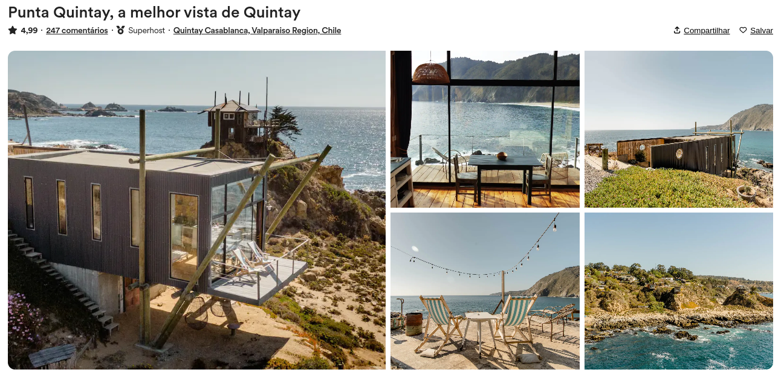

<h1 align="center">
  Repositório template - Tela do airbnb
</h1>

## 💻 Projeto

Neste tutorial passo a passo, você aprenderá como criar a tela do Airbnb usando HTML e CSS. Vamos explorar as técnicas essenciais para a criação de uma interface, incluindo o uso do display grid e de alguns seletores do CSS. Se você é um iniciante em front-end ou deseja aprimorar suas habilidades em HTML e CSS, este tutorial é perfeito para você!

## 📝 Aprendizados

- [x] Uso da propriedade **grid** do `display`
- [x] Uso do seletor `not` do css
- [x] Uso do seletor `has` do css
- [x] Animação com a propriedade `scale` do css

## 📺 Vídeo tutorial

